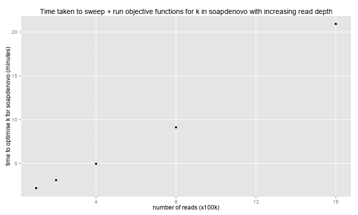
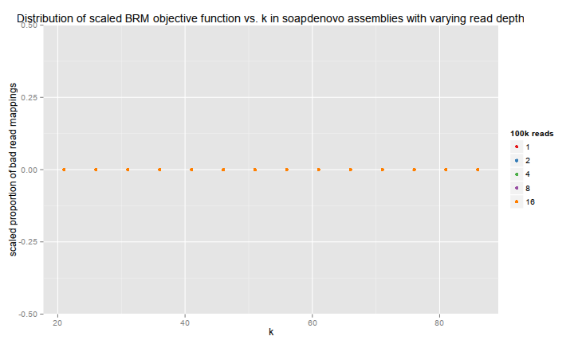
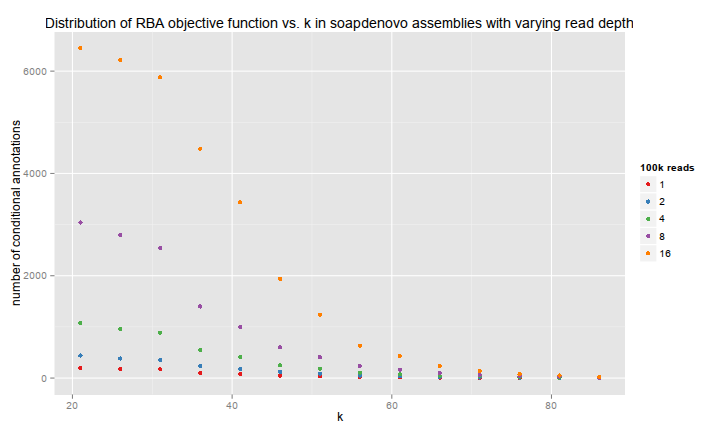
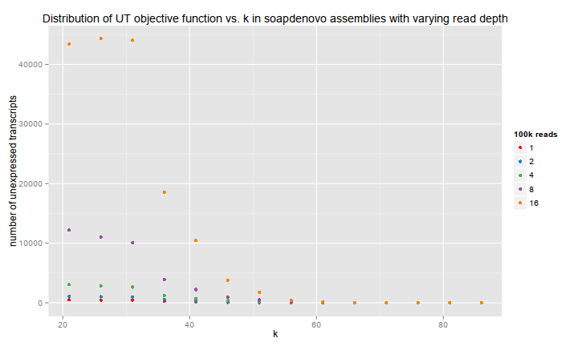
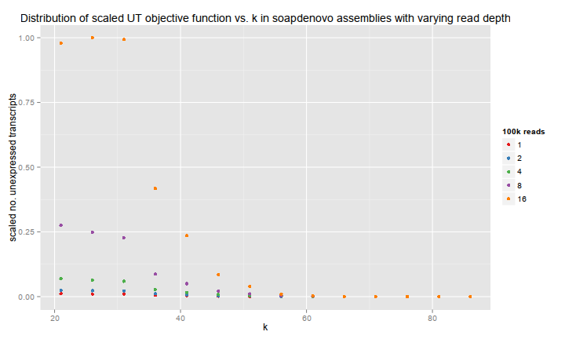
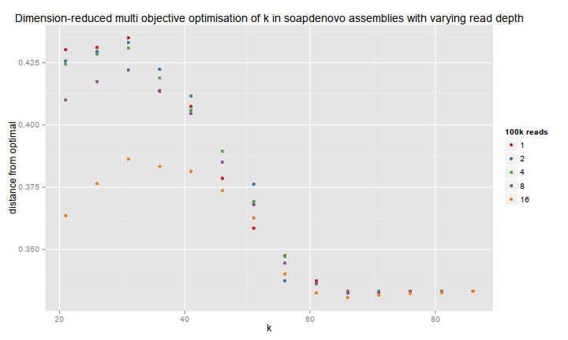
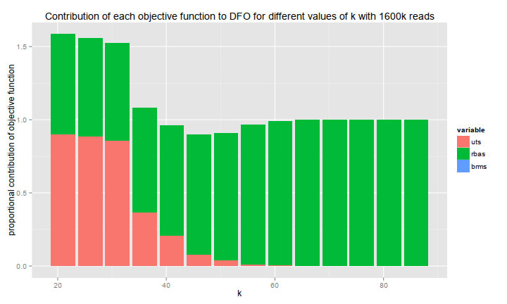
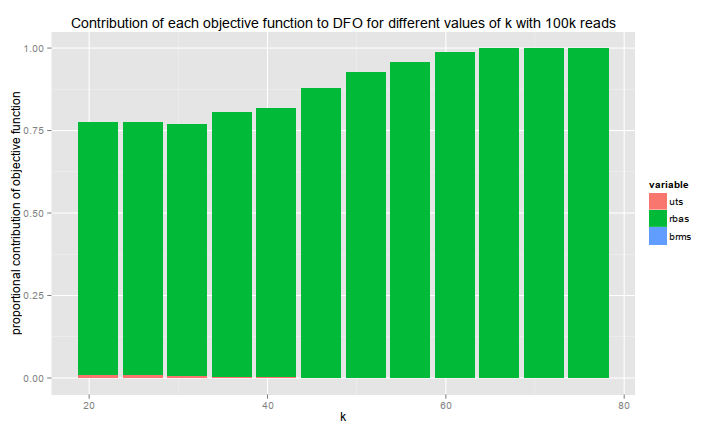

de-novo transcriptome assembly development report
=================================================

## 1: k-sweep in SOAPDenovoTrans with varying read depth

Reads were subsampled at 1, 2, 4, 8, and 16 x 100k pairs from trimmed, normalised, paired 100bp rice Illumina reads.
Assemblies were performed using default settings for SOAPDenovoTrans (soapdt) with varying values of *k* from 21-86 with step 4.
All calculations were run on a 24-core Intel i7 node with 100GB RAM and with files stored in tmpfs (ramdisk) for speed.

### Assembly time scales approximately linearly with read sample size

Notably, the full k-sweep with 100k reads took only around one minute.
 

### Three objective functions

Three objective functions were used to analyse each assembly:
* _brm_ : bad read mappings
* _rba_ : conditional annotation
* _ut_: unexpressed transcripts

       

### Dimension-reduction of the three objective functions
   

