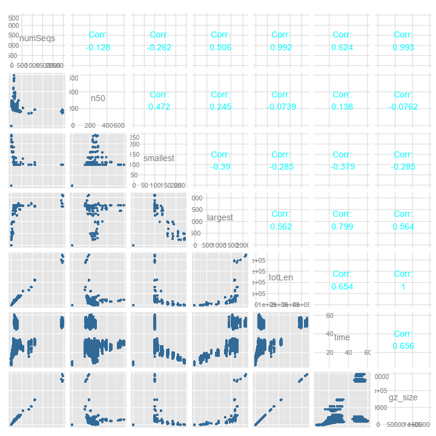
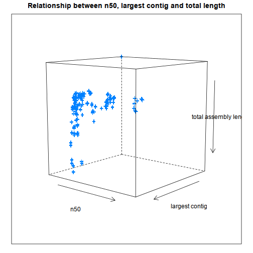

de-novo transcriptome assembly development report 2
========================================================

## 1: all-parameter combinatorial sweep in SOAPDenovoTrans with 100k read pairs

100k read paired were subsampled from trimmed, normalised, paired 100bp rice Illumina reads. A class, [ParameterSweeper](https://github.com/Blahah/biopsy/blob/master/lib/biopsy/parametersweeper.rb), was written for the Bioinformatic Optimisation System (BIOPSY) and used to generate a full combinatorial parameter sweep for SOAPDenovoTrans.

13,975 assemblies were conducted by varying 7 parameters with the ranges shown below.

- K: (21..80).step(8) # k value
- M: (0..3) # mergelevel: def 1, min 0, max 3 
- d: (0..6).step(2) # KmerFreqCutoff: delete kmers with frequency no larger than (default 0)
- D: (0..6).step(2) # edgeCovCutoff: delete edges with coverage no larger than (default 1)
- G: (25..150).step(50) # gapLenDiff(default 50): allowed length difference between estimated and filled gap
- e: (2..12).step(5) # contigCovCutoff: delete contigs with coverage no larger than (default 2)
- t: (2..12).step(5) # locusMaxOutput: output the number of transcriptome no more than (default 5) in one locus

For each assembly, basic metrics were collected, both during the run (e.g. time to assemble) and post-assembly (N50, total length, longest contig, shortest contig, number of contigs, size of gzipped assembly). More advanced metrics are currently processing for the full set of assemblies (~5000/13975 completed as of 10:00 Friday 26th July).

## Relationships between basic metrics

### Pairwise

An all-vs-all plot of the collected data shows pairwise relationships between them:
  

Expected linear correlations are evident between number of contigs (numSeqs), total length (totLen) and gz_size. More complex relationships are implied between other pairs, for example:

- n50 vs totLen
- n50 vs largest
- largest vs totLen

### Sets of three

We can plot three metrics together to see three-way relationships.

 

## Relationships between parameters and metrics

To understand how these metrics are affected by different parameters, we can assign one or more parameters to graphical dimensions including colour and symbol.

## Objective function-related metrics

objective fucntion code:

- [bad read mappings](https://github.com/Blahah/biopsy/blob/master/lib/biopsy/objectives/bad_read_mappings.rb)
- [unexpressed transcripts](https://github.com/Blahah/biopsy/blob/master/lib/biopsy/objectives/unexpressed_transcripts.rb)
- [conditional annotations](https://github.com/Blahah/biopsy/blob/master/lib/biopsy/objectives/reciprocal_best_annotation.rb)
