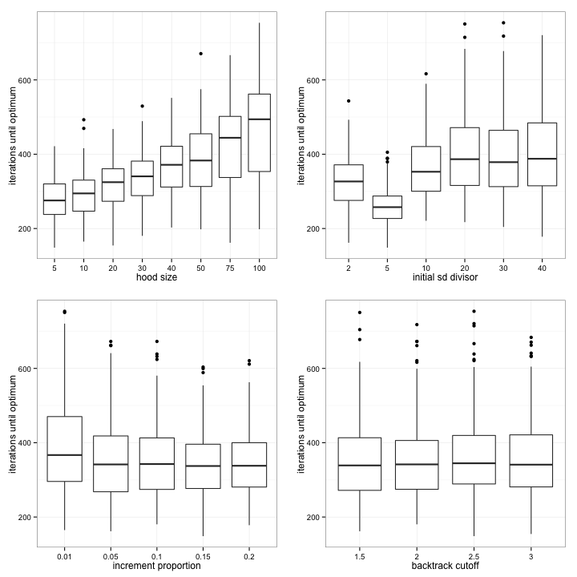
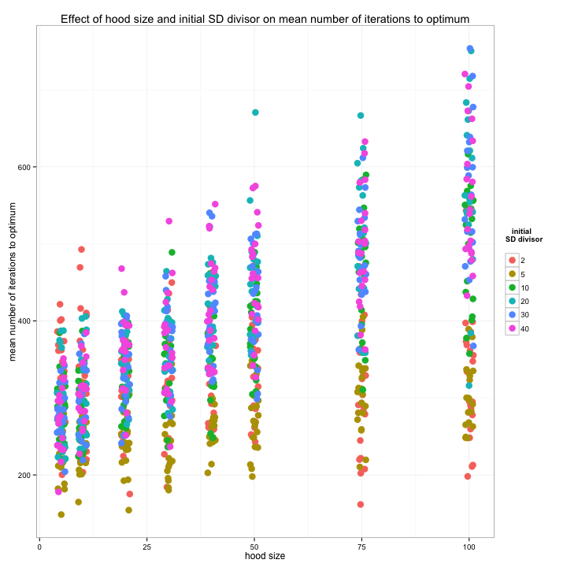
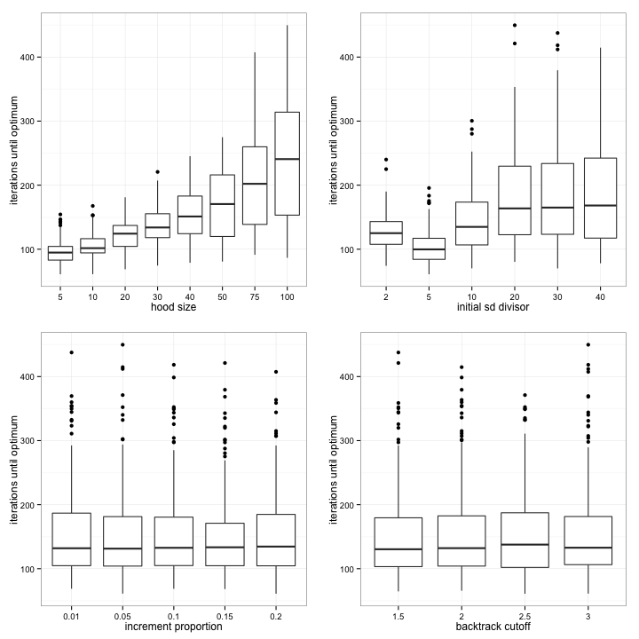
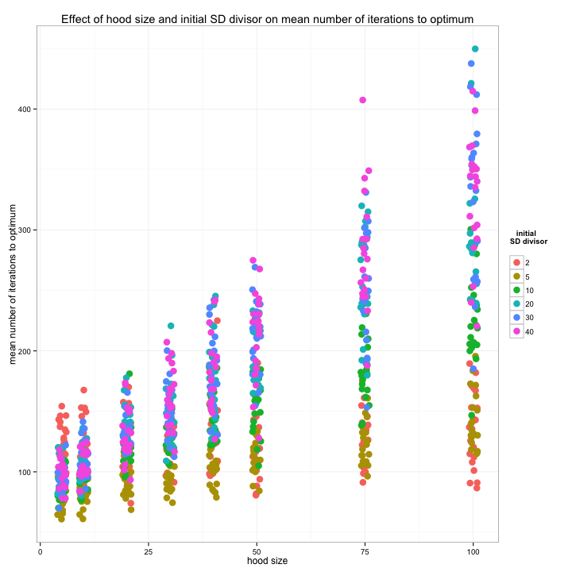
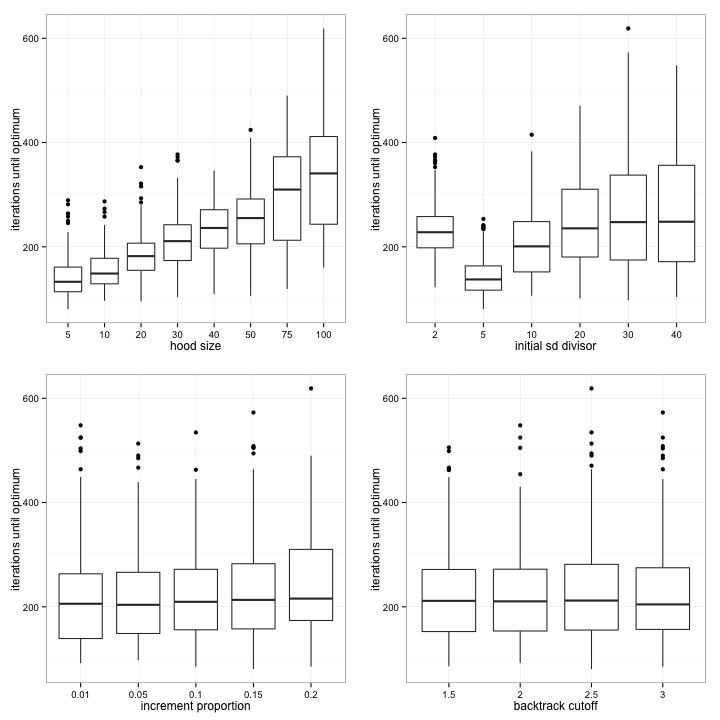
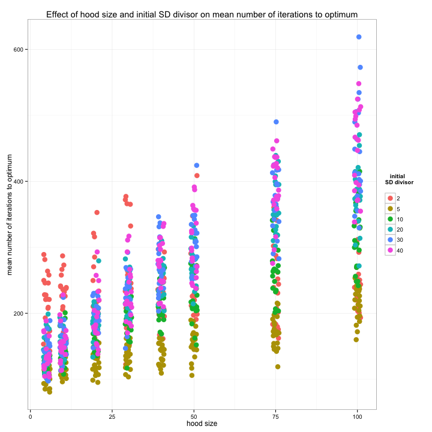

Report 3
========================================================

Tabu Search was implemented for the bioinformatic optimisation system. The Parameter Sweeper module was used to discover the optimal parameters for the Tabu Search algorithm.


The algorithm was optimised separately for different objectives on the SOAPdt dataset.

## N50


```r
analyseObjective("n50")
```

  

```
##                                           Df   Sum Sq  Mean Sq F value
## hood_size                                  1 3.37e+07 33689042 1034.11
## sd_divisor                                 1 1.48e+07 14826105  455.10
## inc_prop                                   1 1.32e+06  1316722   40.42
## bt_cutoff                                  1 1.04e+05   103604    3.18
## hood_size:sd_divisor                       1 7.88e+06  7880921  241.91
## hood_size:inc_prop                         1 2.40e+05   240484    7.38
## sd_divisor:inc_prop                        1 1.37e+06  1373404   42.16
## hood_size:bt_cutoff                        1 1.01e+05   101337    3.11
## sd_divisor:bt_cutoff                       1 2.63e+05   263060    8.07
## inc_prop:bt_cutoff                         1 3.02e+04    30194    0.93
## hood_size:sd_divisor:inc_prop              1 4.33e+05   433118   13.29
## hood_size:sd_divisor:bt_cutoff             1 5.41e+03     5409    0.17
## hood_size:inc_prop:bt_cutoff               1 1.81e+03     1810    0.06
## sd_divisor:inc_prop:bt_cutoff              1 2.94e+03     2945    0.09
## hood_size:sd_divisor:inc_prop:bt_cutoff    1 4.21e+02      421    0.01
## Residuals                               9487 3.09e+08    32578        
##                                          Pr(>F)    
## hood_size                               < 2e-16 ***
## sd_divisor                              < 2e-16 ***
## inc_prop                                2.1e-10 ***
## bt_cutoff                               0.07457 .  
## hood_size:sd_divisor                    < 2e-16 ***
## hood_size:inc_prop                      0.00660 ** 
## sd_divisor:inc_prop                     8.8e-11 ***
## hood_size:bt_cutoff                     0.07782 .  
## sd_divisor:bt_cutoff                    0.00450 ** 
## inc_prop:bt_cutoff                      0.33571    
## hood_size:sd_divisor:inc_prop           0.00027 ***
## hood_size:sd_divisor:bt_cutoff          0.68366    
## hood_size:inc_prop:bt_cutoff            0.81364    
## sd_divisor:inc_prop:bt_cutoff           0.76368    
## hood_size:sd_divisor:inc_prop:bt_cutoff 0.90950    
## Residuals                                          
## ---
## Signif. codes:  0 '***' 0.001 '**' 0.01 '*' 0.05 '.' 0.1 ' ' 1 
##    hood_size sd_divisor inc_prop bt_cutoff  mean    sd
## 35         5          5     0.15       2.5 148.5 50.74
```


## Length of largest contig


```r
analyseObjective("largest")
```

  

```
##                                           Df   Sum Sq  Mean Sq F value
## hood_size                                  1 21229820 21229820 2757.78
## sd_divisor                                 1  7463057  7463057  969.46
## inc_prop                                   1        7        7    0.00
## bt_cutoff                                  1     8548     8548    1.11
## hood_size:sd_divisor                       1  6122496  6122496  795.32
## hood_size:inc_prop                         1    23560    23560    3.06
## sd_divisor:inc_prop                        1      992      992    0.13
## hood_size:bt_cutoff                        1       60       60    0.01
## sd_divisor:bt_cutoff                       1     1824     1824    0.24
## inc_prop:bt_cutoff                         1     1534     1534    0.20
## hood_size:sd_divisor:inc_prop              1    42223    42223    5.48
## hood_size:sd_divisor:bt_cutoff             1      126      126    0.02
## hood_size:inc_prop:bt_cutoff               1    15001    15001    1.95
## sd_divisor:inc_prop:bt_cutoff              1      721      721    0.09
## hood_size:sd_divisor:inc_prop:bt_cutoff    1    10708    10708    1.39
## Residuals                               9584 73779078     7698        
##                                         Pr(>F)    
## hood_size                               <2e-16 ***
## sd_divisor                              <2e-16 ***
## inc_prop                                 0.975    
## bt_cutoff                                0.292    
## hood_size:sd_divisor                    <2e-16 ***
## hood_size:inc_prop                       0.080 .  
## sd_divisor:inc_prop                      0.720    
## hood_size:bt_cutoff                      0.930    
## sd_divisor:bt_cutoff                     0.626    
## inc_prop:bt_cutoff                       0.655    
## hood_size:sd_divisor:inc_prop            0.019 *  
## hood_size:sd_divisor:bt_cutoff           0.898    
## hood_size:inc_prop:bt_cutoff             0.163    
## sd_divisor:inc_prop:bt_cutoff            0.760    
## hood_size:sd_divisor:inc_prop:bt_cutoff  0.238    
## Residuals                                         
## ---
## Signif. codes:  0 '***' 0.001 '**' 0.01 '*' 0.05 '.' 0.1 ' ' 1 
##    hood_size sd_divisor inc_prop bt_cutoff mean    sd
## 39         5          5      0.2       2.5 60.9 33.94
```


## Read pairs mapping


```r
analyseObjective("brm_paired")
```

  

```
##                                           Df   Sum Sq  Mean Sq F value
## hood_size                                  1 3.89e+07 38926950 2494.37
## sd_divisor                                 1 8.79e+06  8790572  563.28
## inc_prop                                   1 4.05e+05   404520   25.92
## bt_cutoff                                  1 4.55e+03     4546    0.29
## hood_size:sd_divisor                       1 1.04e+07 10402635  666.58
## hood_size:inc_prop                         1 5.57e+04    55718    3.57
## sd_divisor:inc_prop                        1 8.86e+04    88610    5.68
## hood_size:bt_cutoff                        1 5.38e+03     5383    0.34
## sd_divisor:bt_cutoff                       1 2.60e+01       26    0.00
## inc_prop:bt_cutoff                         1 1.71e+03     1709    0.11
## hood_size:sd_divisor:inc_prop              1 1.60e+05   160146   10.26
## hood_size:sd_divisor:bt_cutoff             1 1.21e+03     1208    0.08
## hood_size:inc_prop:bt_cutoff               1 3.13e+02      313    0.02
## sd_divisor:inc_prop:bt_cutoff              1 7.97e+03     7966    0.51
## hood_size:sd_divisor:inc_prop:bt_cutoff    1 3.48e+03     3484    0.22
## Residuals                               9582 1.50e+08    15606        
##                                          Pr(>F)    
## hood_size                               < 2e-16 ***
## sd_divisor                              < 2e-16 ***
## inc_prop                                3.6e-07 ***
## bt_cutoff                                0.5894    
## hood_size:sd_divisor                    < 2e-16 ***
## hood_size:inc_prop                       0.0589 .  
## sd_divisor:inc_prop                      0.0172 *  
## hood_size:bt_cutoff                      0.5570    
## sd_divisor:bt_cutoff                     0.9672    
## inc_prop:bt_cutoff                       0.7407    
## hood_size:sd_divisor:inc_prop            0.0014 ** 
## hood_size:sd_divisor:bt_cutoff           0.7808    
## hood_size:inc_prop:bt_cutoff             0.8874    
## sd_divisor:inc_prop:bt_cutoff            0.4750    
## hood_size:sd_divisor:inc_prop:bt_cutoff  0.6366    
## Residuals                                          
## ---
## Signif. codes:  0 '***' 0.001 '**' 0.01 '*' 0.05 '.' 0.1 ' ' 1 
##    hood_size sd_divisor inc_prop bt_cutoff mean   sd
## 35         5          5     0.15       2.5 80.6 32.8
```

